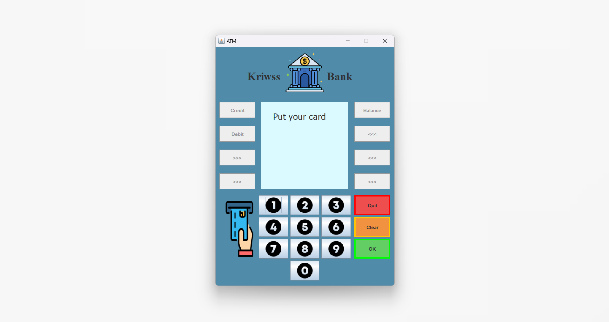
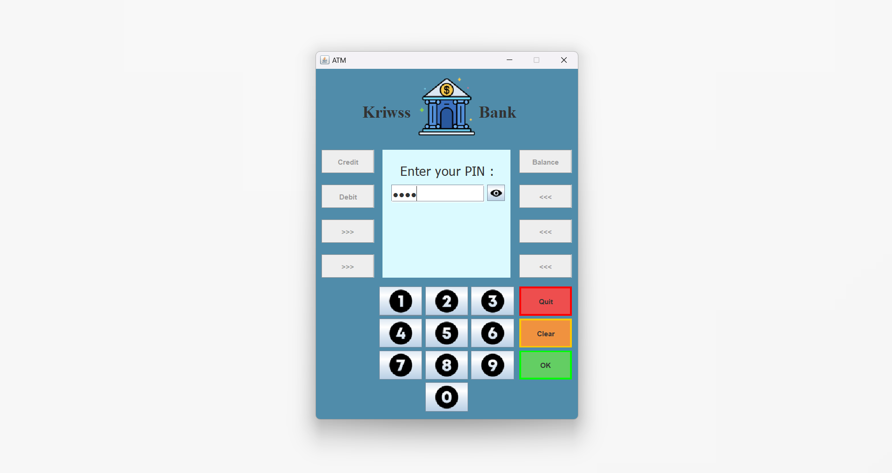
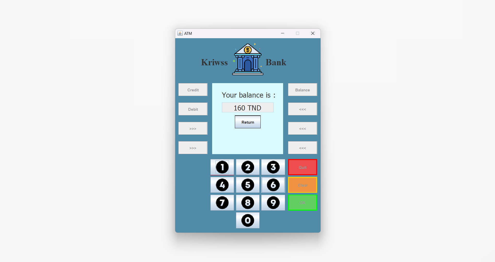
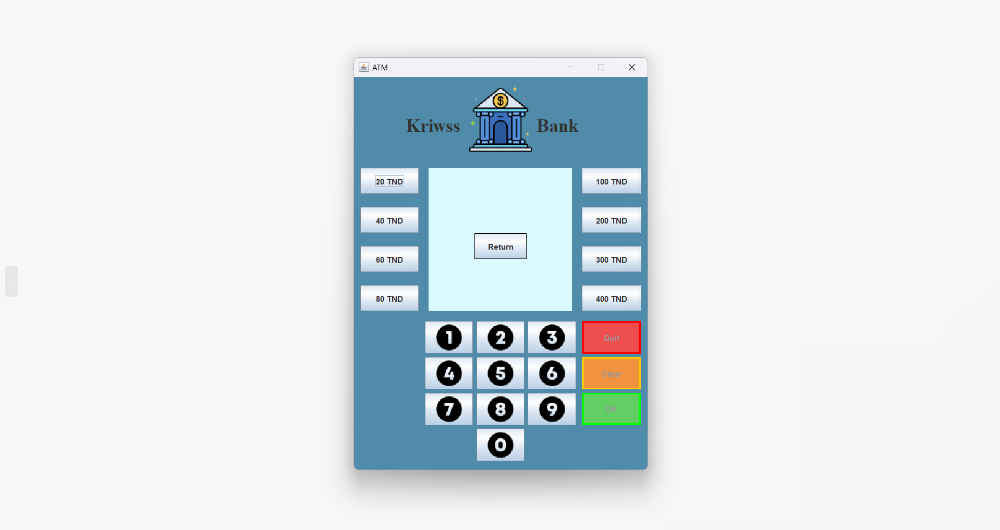

# ATM App

A Java Card project simulating an ATM banking application.

***

> Table of Contents
1. Overview
2. Installation
3. Usage
4. Screenshots
5. Technologies Used
6. Contributing
7. Contact

***

## Overview
ATM app project simulates the workflow of bank ATM through applets, allowing users to perform common banking operations like balance inquiries and withdrawals. Experience a lightweight banking interface designed for Java Card environments.

## Installation
To set up the project locally, follow these steps:

  1. Ensure you have the following installed on your system:
  * **Java IDE:** A Java Integrated Development Environment (IDE) is required. You can use any IDE of your choice, such as Eclipse, IntelliJ IDEA, or NetBeans.
  * **Java Card Development Kit:** Download and install the appropriate Java Card Development Kit.
  * **Java Development Kit (JDK):** Ensure you have JDK 8 or higher installed.

  2. Clone the Repository:
  ```
  git clone https://github.com/AkramNsir/ATM-app.git
  ```

  3. Open your IDE.

  4. Import the Project:
  * Go to **File > Import.**
  * Select **Existing Projects into Workspace** under the **General** category.
  * Click **Next**, then browse to the cloned repository.
  * Select the project and click **Finish**.

  5. Set Up the Java Card Development Kit:
  * Ensure the Java Card Development Kit is correctly configured in Eclipse by going to **Window > Preferences > Java > Installed JREs.** Add the JDK if it’s not already listed.

  6. Compile the Applets:
  * Right-click on the project in the Project Explorer and select **Build Project.**

  7. Check for Compilation Errors:
  * Ensure there are no compilation errors in the **Problems** view. Fix any issues that arise.

 

## Usage
  1. Open cmd and go to the bin folder inside project directory :

  2. Run this command to run the simulater:
  ```
  jcwde monapplet.app
  ```

  3. Go to your IDE and run your "clientFunction" file

## Screenshots 
Here are some screenshots of ATM-app project:

### Landing Interface


### Enter Code Interface


### Balance Interface


### Credit Interface 


### Debit Interface 


## Technologies Used
<div style="display: flex; gap: 20px; flex-wrap: wrap;">

* <div style="background-color:blue;color:white;border-radius:5px;padding:10px;margin:5px;">
     Java
  </div>
</div>

## Contributing
Contributions to CannibalsMissionairiesGame are welcome! To contribute:

  1. Fork the repository.
  2. Create a new branch 

  ```
  git checkout -b feature-branch
  ```
  3. Make your changes.
  4. Commit your changes

  ```
  git commit -am "Add new feature"
  ```
  5. Push to the branch
  ```
  git push origin feature-branch
  ```
  6. Create a new Pull Request.

## Contact
For any inquiries or issues, feel free to reach out:

Name: Mohamed Akram Nsir    
Email: akramnsir5@gamil.com    
GitHub: https://github.com/AkramNsir
